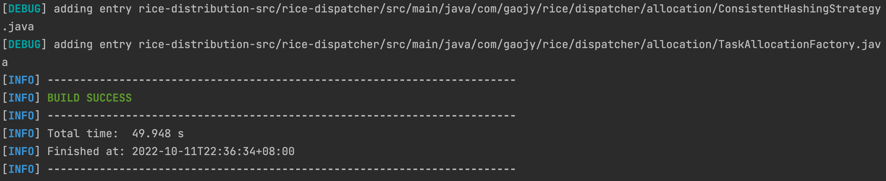
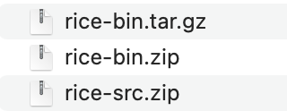

<h1>编译</h1>

因为Rice暂时还没有提交到公共的maven仓库，所以这边是采用手动打包的方式来引入到项目中。

```
git clone git@github.com:gaojiayi/RICE.git

mvn clean install -Dmaven.test.skip=true

cd rice-distribution

mvn -X clean package assembly:single

```

根据控制台提示，如下显示表示已成功build
<div ></div>


在target目录下会生成3个压缩包

