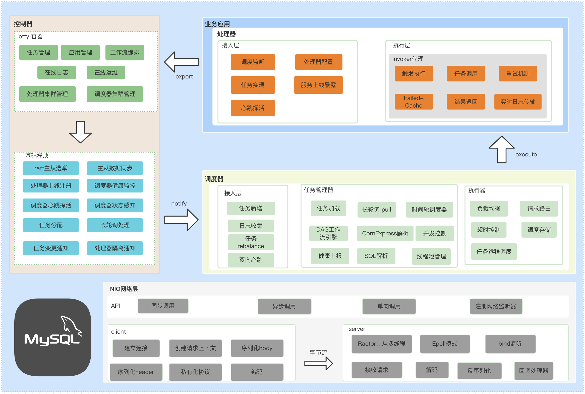

# 架构设计

* 处理器连接主控制器，直到控制器连接成功并告知调度器。

* 所有的调度器都要与主控制器建立长轮询获取任务更新，并维护心跳。心跳上报处理器状态，主控制器处理状态数据。

  当一个调度器宕机，主控制器负责通知其他调度器，调度器接收到通知后，基于一致性hash算法重加载任务(任务rebalance)

  当新增一个调度器之后,主控制器负责通知其他调度器，其他调度器再次执行任务rebalance

* 当添加任务的时候，会基于一致性hash计算出一个调度器，并告知调度器,调度器会添加任务

* 当删除任务，新增change记录，基于长轮询会通知响应的调度器，调度器会shundown任务调度执行器

### rice私有化协议
|  数据组成 |  ori header length  | header Data   |   body Data |
| ------------ | ------------ | ------------ | ------------ |
| 占用字节  | 4  |  通过计算获得 |  总的length - 4 - header length | |

整个数据报文有4字节的原始头长度，header数据以及业务数据组成，其中ori header length的整型值可以计算出真实的header数据长度。

**header Data**  

header data的数据格式如下：

|  占用字节数 |  2byte | 1byte |   2byte | 4byte  | 4byte | 4byte  | 未知 byte  | 4byte | 未知 byte |
| ------------ | ------------ | ------------ | ------------ | ------------ | ------------ | ------------ | ------------ | ------------ | ------------ |
| 数据作用  | code | LanguageCode |   version | opaque  | flag | remarkLength  | remarkContent  | extFieldsLength | ExtFields |
