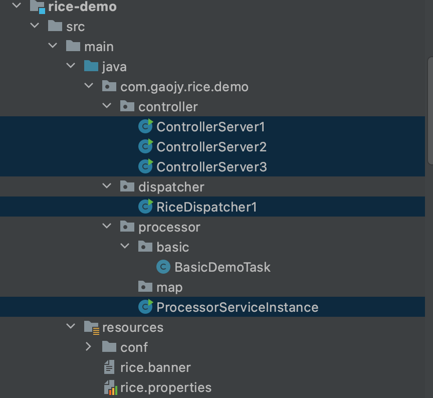

# 🎉 Quick Start

<h2>前置工作</h2>

参考前一个章节的部署,以rice-demo为例，分别介绍如何接入到rice平台，创建各种类型的任务，以及任务如何被调度。

* 分别启动3个controller服务器  ControllerServer1   ControllerServer2   ControllerServer3
* 启动dispatcher 调度器   RiceDispatcher1
* UI端注册任务          &#x20;
* 最后启动处理器      ProcessorServiceInstance
